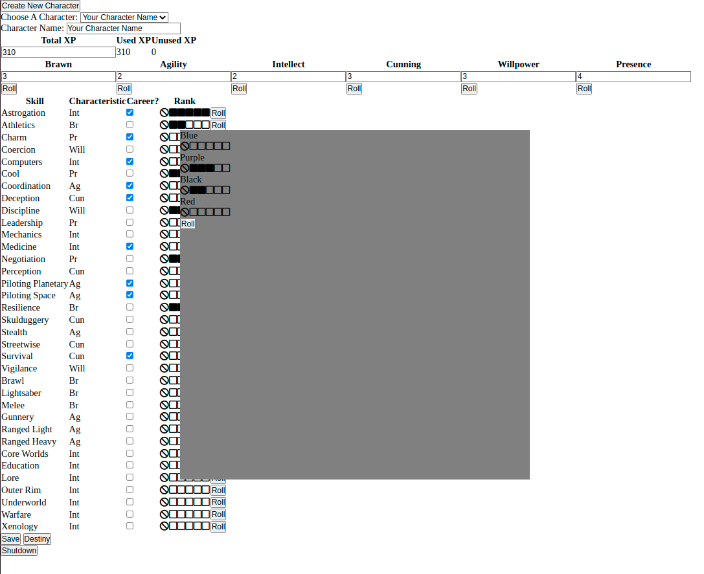

# FFGNDS-Discord-Dice-Roller Helper UI
A very simple UI for [FFGNDS-Discord-Dice-Roller](https://github.com/SkyJedi/FFGNDS-Discord-Dice-Roller).

## Features
- Keeps track of XP, characteristics and skills
- Roll sends [FFGNDS-Discord-Dice-Roller](https://github.com/SkyJedi/FFGNDS-Discord-Dice-Roller) commands to a user specified discord channel

## Images

## User Instructions

1. Download and unzip `<build>-eote-helper-<version>.zip` from Releases.

2. Populate `config.json`
	1. Open and login to discordapp.com in your web browser
		1. Ctrl+shift+I 

		

		2. Go to Application Tab

		

		3. Click on local storage
		4. Click on the “Toggle device toolbar in the top left”
		5. Filter for token

		

		6. Copy token into `config.json` **in quotes**
	2. Get channel ID from server administrator
		* For admins, right click on the channel and click "Copy ID"
		
		

		* Copy channel ID into `cofig.json` **with no quotes**
4. Click EOTE-HELPER.exe
5. Open broswer to 0.0.0.0:port (linux) or localhost:port (windows)

If it works, you should be greeted with this first screen:

### Notes
* Currently the name acts as the key. So, if you save, a json file will be created in the `saved` folder with the filename being whatever is in the character name box.
	+ For example, You create \<character 1\>, and click save. Then you decide to change the name to \<character 2\>, and click save. There will now be two characters where \<character 2\> is a seperate duplicate of \<character 1\>.
	+ The character can be deleted by deleting its corresponding `<character name>.json` file in the `saved` folder

## Developers

### Overview

This is a simple HTTP server written in python that communicates to discord through [discord.py](https://github.com/Rapptz/discord.py).

The python server does super simple templating to fill `main.tmpl` with playerData. The javascript handles the rest.

The webpage sends commands to the server such as "save"(which saves the given json payload to file), or "destiny" (which performs !destiny roll).

To make it a standalone executable, [pyinstaller](https://github.com/pyinstaller/pyinstaller) is used.

### Development Instructions
1. Clone the repository
2. Inside the repository
	1. This has only been tested in python 3.8 use other versions at your own risk.
	2. `pip install -r requirements.txt`
	3. `python main.py`

### Make Standalone Executable
PIP should have installed [pyinstaller](https://github.com/pyinstaller/pyinstaller).

The spec file is already there so just run
`pyinstaller main.spec`. The output folder should be `dist/EOTE-HELPER` and the output executable should be `EOTE-HELPER` (or `EOTE-HELPER.exe` if running on windows)

### Server
The main server code is located inside `eote.py`.

First, the server reads from `config.json` and logs into discord, it then asyncronously starts the http server.

Second, on GET, the HTTP server builds the player data array by combining all the json files inside `saved` into an array then puts that into the template. It also takes the default playerdata from `default.json` and puts that in the javascript part of the main webpage.

Third, on POST, the HTTP server gets either just a command, or a command then a seperator (a constant defined in the code) the json. Here is a list of the API:

| Command | Json | Description |
| - | - | - |
| shutdown      | \<nothing\>       | Closes the server. |
| destiny      | \<nothing\>       | Performs "!destiny roll" in channel. |
| roll      | `{'greens':<num green die>, 'yellows':<num yellow die>, ..., 'reds':<num red die>}`   | performs "!roll \<command\>" in channel(e.g. "!roll 2g 1y 3p").|
| save | one character's data in json format | Saves the character data to file using data["base"]["name"] as the file name. |

## Client
The client is the real workhorse of this application. On dom load it builds the page almost completely from scratch using Javascript.

I tried to maintain a model view controller pattern where the inputs would change the `playerData` model then re-render the page. The renderer only reads from playerData so everything stays consistent. 

The core of it comes down to the `renderPage()` function.

